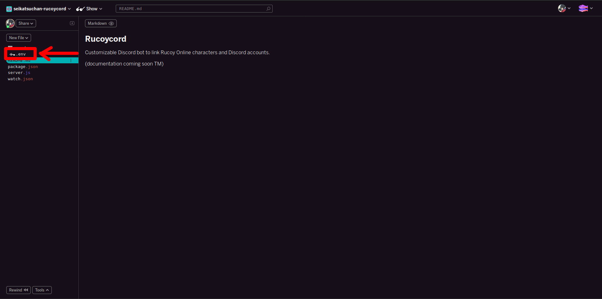

# Changing your bot's settings

## .env

All of the bot's settings are found within a file, **.env**. Click the file name in the sidebar of the glitch page.



The file's contents should look something like this:

```bash
# BASE SETTINGS, EVERYTHING BELOW IS REQUIRED
TOKEN=YOUR_BOT_TOKEN
OWNER=YOUR_USER_ID
PREFIX=/
ADMIN_ROLE=SERVER_ADMIN_ROLE_ID
FREE_LINKING=false
SERVER=SERVER_ID

# AUTOROLE SETTINGS
AUTOROLE=false
SUPPORTERROLE=SUPPORTER_ROLE_ID
LEVEL100ROLE=LEVEL_100_ROLE_ID
LEVEL200ROLE=LEVEL_200_ROLE_ID
LEVEL300ROLE=LEVEL_300_ROLE_ID
LEVEL400ROLE=LEVEL_400_ROLE_ID
LEVEL500ROLE=LEVEL_500_ROLE_ID
LEVEL600ROLE=LEVEL_600_ROLE_ID

# VC ROLE SETTINGS
VCROLE=false
VCROLEID=VC_ROLE_ID
```

Here you're going to replace the values with your own bot/server's. First thing's first, replace "YOUR\_BOT\_TOKEN" with the token you copied earlier.

Next you're going to want to grab your user ID. If you don't already have it enabled, turn on "Developer Mode" in Discord's appearance settings, then right click your name and "Copy ID", then replace "YOUR\_USER\_ID" with your own ID number.

For "ADMIN\_ROLE", go into your server's role settings, and right click the name of the role to copy it's ID

"SERVER" is the ID of the server you're adding the bot to, this can be aquired by right clicking the server's icon

"PREFIX" is the character used to trigger the bot's commands, default is "/"

"FREE\_LINKING" when set to "true", allows all users to link accounts, instead of admins. I recommend leaving this as false.

When finished, your file should look more or less like this:

```bash
# BASE SETTINGS, EVERYTHING BELOW IS REQUIRED
TOKEN=NjI3NTAwNzQyNjg0NDQyNjU1.XY9tRw.dTaIW7UNqgBF-30zOFLEEUK4uBo
OWNER=395268786913017857
PREFIX=/
ADMIN_ROLE=592104070295191553
FREE_LINKING=false
SERVER=342471443218432031

# AUTOROLE SETTINGS
AUTOROLE=false
SUPPORTERROLE=SUPPORTER_ROLE_ID
LEVEL100ROLE=LEVEL_100_ROLE_ID
LEVEL200ROLE=LEVEL_200_ROLE_ID
LEVEL300ROLE=LEVEL_300_ROLE_ID
LEVEL400ROLE=LEVEL_400_ROLE_ID
LEVEL500ROLE=LEVEL_500_ROLE_ID
LEVEL600ROLE=LEVEL_600_ROLE_ID

# VC ROLE SETTINGS
VCROLE=false
VCROLEID=VC_ROLE_ID
```

## Rebooting the bot

Once you're done updating the bot's settings, you'll need to reboot it. Head over to **watch.json** on the sidebar. The file should look like this:

```text
{
    "install": {
      "include": [
        "^package\\.json$",
        "^\\.env$"
      ]
    },
    "restart": {
      "exclude": [
        "^public/",
        "^dist/"
      ],
      "include": [
        "\\.js$",
        "\\.json"
      ]
    },
    "throttle": 1800000
}
```

Simply add a space at the end of the file, then backspace it. The bot will restart in a few seconds afterwards.

