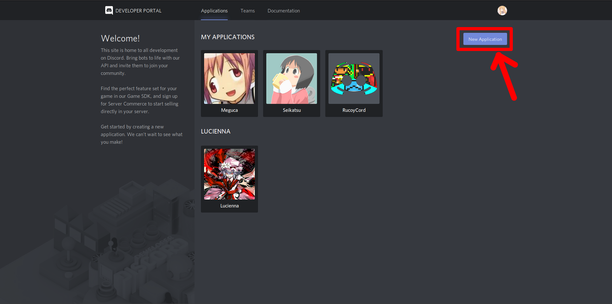
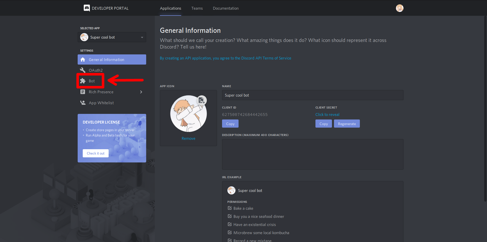
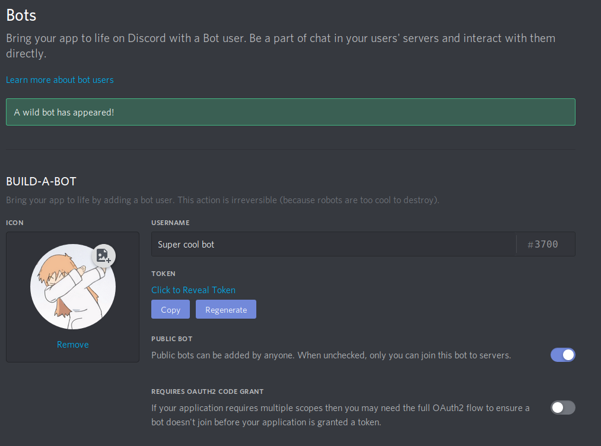
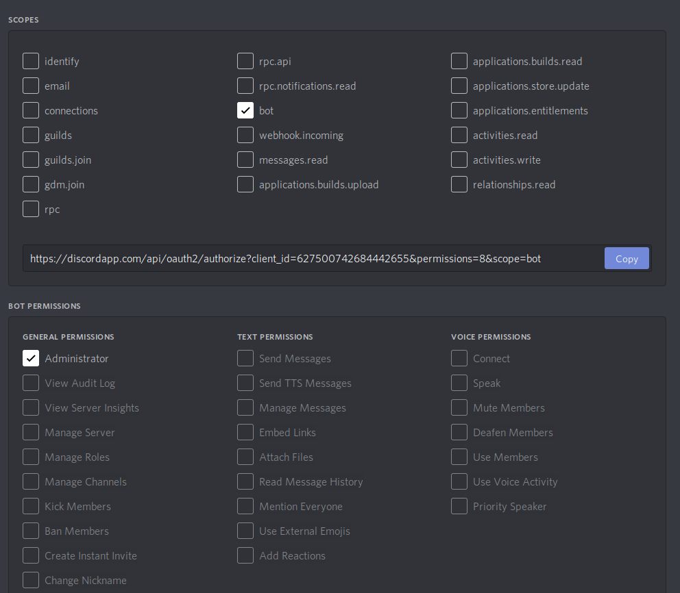

# Creating a Discord Bot

## Go to the Discord developer portal and create an application

Go to [https://discordapp.com/developers](https://discordapp.com/developers) and click on New Application. Name it whatever you'd like.

Once it has been created, click on the Bot section, found on the left of the page

Click Add Bot, and confirm after all of the spooky warnings. Once you're done your page should look something like this:

Copy the token, and save it somewhere to use later, I also recommend turning "Public Bot" off, as this bot only works properly in one server at a time.


Never share your token with anyone! If they have it they can control your bot!


Once that's done we need to invite our bot! Click on OAuth2 in the sidebar. You should be presented with a page full of checkboxes. Check "bot" then check "Administrator" \(or whatever permissions you want the bot to have\) in the second set of boxes. Copy the generated URL and paste it into a new tab to add the bot to your server.

