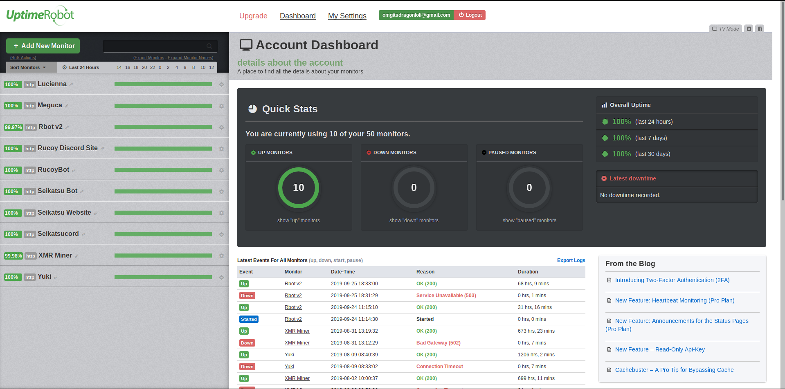
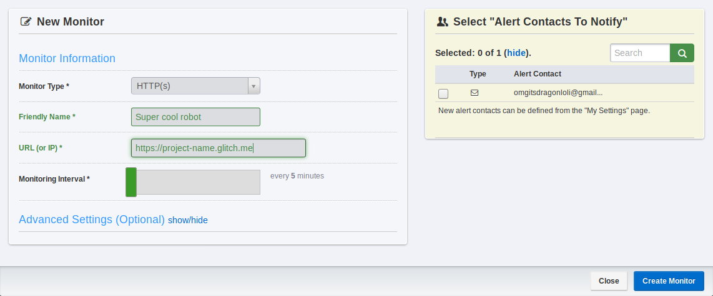

# Keeping your bot online

## Setting up your Uptime Robot

Head over to [uptimerobot.com](https://uptimerobot.com) and create an account. Once you're logged in you should be redirected to a dashboard similar to this one:

Click "Add New Monitor"

For monitor type, select HTTP\(S\), change the friendly name to whatever.

For URL, type "https://**project-name**.glitch.me, replacing "project-name" with your glitch project. \(this can be found in the top left of the glitch page\)

Leave the Monitoring Interval at 5 minutes, and click Create Monitor.


You might get a warning about not selecting an alert email, feel free to ignore it.


All done! Your bot should be working normally. If you have any issues, [join the Rucoy Online discord](https://discord.gg/5KGeCuG) and send me a message @Seikatsu\#0001

