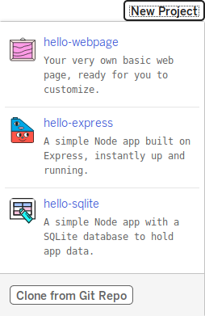
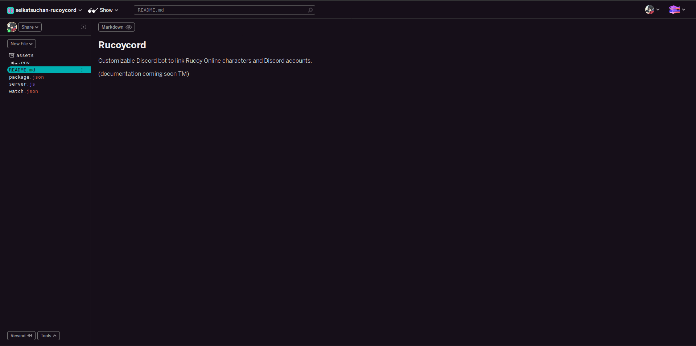

# Setting up a Glitch project

## Create a Glitch account/project

Head over to [glitch.com](https://glitch.com) and create an account. Once that's done, click New Project at the top of the page. You'll be presented with the following options:

Click on "Clone from Git Repo", and type "https://github.com/SeikatsuChan/Rucoycord.git" into the popup dialogue. Once that's done your screen should look something like this:

